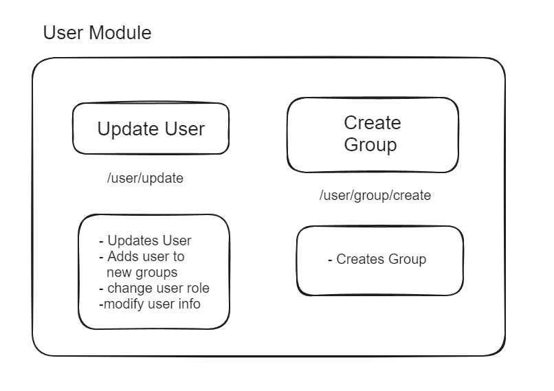
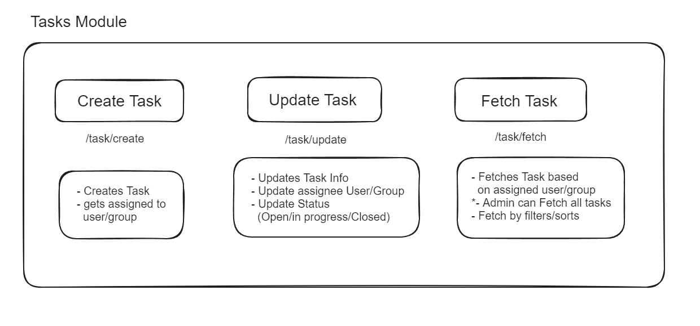

# Task-Management-System
A Backend System for Managing Tasks within an Org with Users and Groups as entities.

# Introduction
A backend system for managing tasks within an organization, featuring user and group management. This project includes functionalities for user registration, authentication, task creation, and management, using JWT for secure authentication.


### Features
User Management:
- Sign up
- Login
- Logout
- Update user information

Group Management:
- Create group
- Add users to group

Task Management:
- Create task
- Update task details
- Fetch tasks with filtering and sorting

Authentication:
- JWT-based authentication (Access Token and Refresh Token)

# API Modules





# Setup

1. Run Redis from a Docker Image.
2. Run Mongo from a Docker Image.
3. Create .env file and add the following creds.

```text
REDIS_URI=redis://127.0.0.1:6379
MONGO_URI=mongodb://127.0.0.1:27017
```
4. Create A Virtual Env and Install Requirements
```bash
python -m venv venv
source venv/bin/activate  # On Windows use `venv\Scripts\activate`
```
```bash
pip install -r requirements.txt
```
5. Start the FastAPI App
```bash
python3 app.py
```

